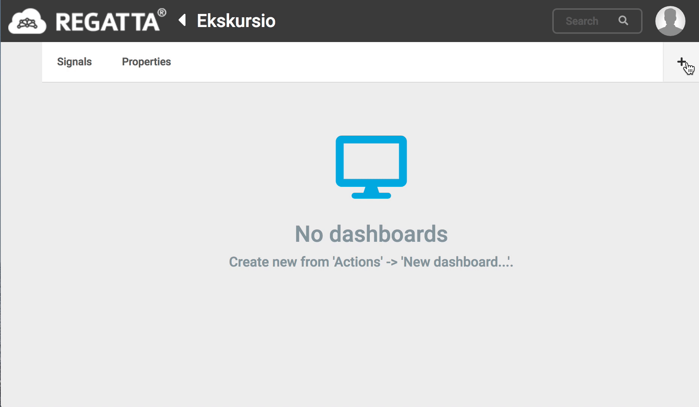
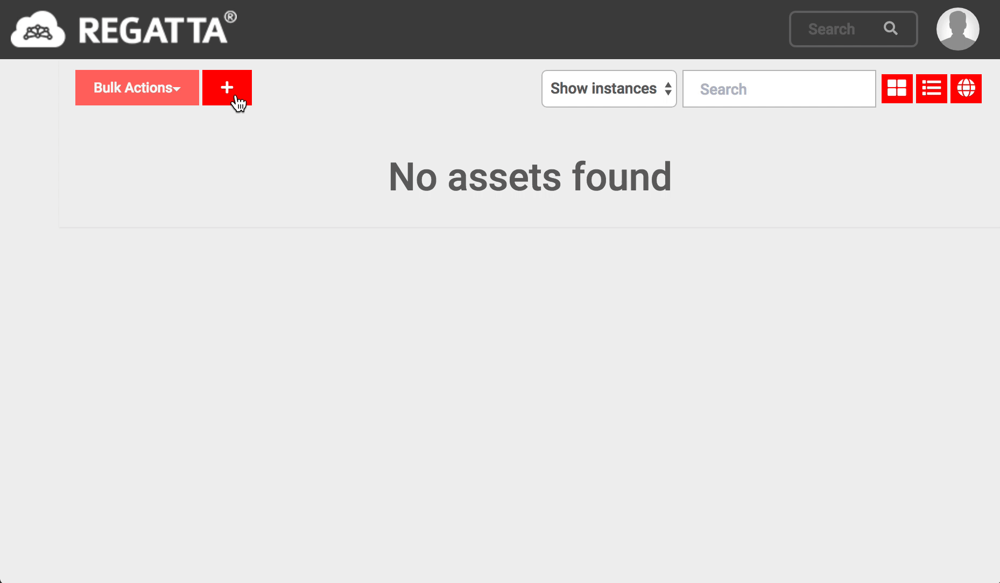

# Library suggestions
* json string to Java Object
	* Jackson 2.x
* http queries
	* OkHttp3

# Writing data to portal
* get apikey from portal in your group's asset's properties page
* endpoint https://demo.remion.com/regattaportal/v1/device/data?apikey=<some_apikey>
* method POST
* body:
{
  	"names": ["signal1", "signal2"],
	"valueRows: [
		{"timestamp": 1000, "values": [1.0, 2.0]}
	]"
}

# Portal
1. Create a dashboard
   
2. Create an asset to Portal
   > Name it something like `Ekskursio_<group-name>`

   
3. Create signals
   
4. Create and configure widgets
   